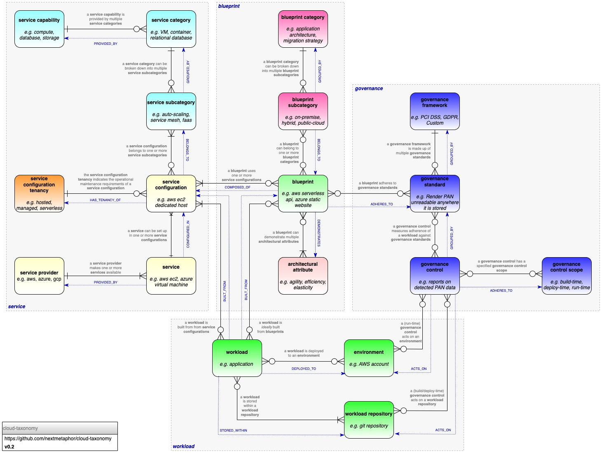
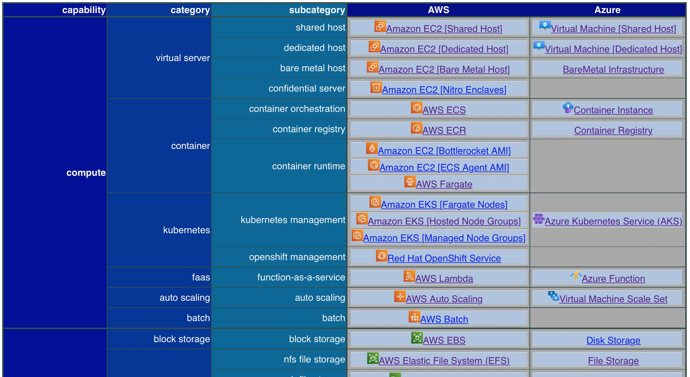

# cloud-taxonomy
Project to model the Cloud Computing taxonomy in a graph representation using [yaml-graph](https://github.com/nextmetaphor/yaml-graph) definitions. 

The data model used for this is as follows:


The following reports are automatically generated from these definitions:
* [table of services from each provider broken down by capability, category and subcategory](https://nextmetaphor.gitlab.io/cloud-taxonomy/index.html)
  
* [service by provider in JSON format](https://nextmetaphor.gitlab.io/cloud-taxonomy/ServiceByProvider.json)
* [categories and subcategories by capability in JSON format](https://nextmetaphor.gitlab.io/cloud-taxonomy/ServiceCapabilityJSON.json)
* [service providers in JSON format](https://nextmetaphor.gitlab.io/cloud-taxonomy/ServiceProviderJSON.json)
* [service tenancies in JSON format](https://nextmetaphor.gitlab.io/cloud-taxonomy/ServiceTenancyJSON.json)

## Installation
### Install `yaml-graph`
First, follow the [installation instructions](https://github.com/nextmetaphor/yaml-graph/blob/main/README.md) to build `yaml-graph`. 
Once this is complete, at the root of the `cloud-taxonomy` repository execute the following to create a `yaml-graph`
container:
```bash
docker run -it -p7474:7474 -p7687:7687 -v $(PWD)/definition:/home/ymlgraph/definition -v $(PWD)/report:/home/ymlgraph/report nextmetaphor/yaml-graph
```
## Usage
All of the following commands should be executed from within the `yaml-graph` container.
### Validate the Cloud Taxonomy Definitions
```bash
yaml-graph validate -f definition/definition-format.yml
```
### Building the Cloud Taxonomy Graph
```bash
yaml-graph load
```
Once this is complete, the graph can be examined in the local browser at http://localhost:7474/browser/ using the
following cypher:
```sql
match (n) return n
```

### Building a Static HTML Report
```bash
yaml-graph report -f report/template-format.yaml -t report/output-template.gohtml > report/cloud-taxonomy.html
```

### Building a Table
```bash
yaml-graph validate -f definition/definition-format.yml && yaml-graph report --load -f report/table-report/fields.yaml -t report/table-report/template.gohtml > report/table-report/table-report.html
 ```

### Building a JSON Document
```bash
yaml-graph report -f report/ServiceByProviderJSON/fields.yaml -t report/ServiceByProviderJSON/template.gohtml > report/ServiceByProviderJSON/document.json

# ServiceProvider
yaml-graph report -f report/ServiceProviderJSON/fields.yaml -t report/ServiceProviderJSON/template.gohtml > report/ServiceProviderJSON/document.json

# ServiceTenancy
yaml-graph report -f report/ServiceTenancyJSON/fields.yaml -t report/ServiceTenancyJSON/template.gohtml > report/ServiceTenancyJSON/document.json

# ServiceCapability
yaml-graph report -f report/ServiceCapabilityJSON/fields.yaml -t report/ServiceCapabilityJSON/template.gohtml > report/ServiceCapabilityJSON/document.json

# ServiceByCapabilityJSON
yaml-graph report -f report/ServiceByCapabilityJSON/fields.yaml -t report/ServiceByCapabilityJSON/template.gohtml > report/ServiceByCapabilityJSON/document.json

```

## Licence
[](https://opensource.org/licenses/Apache-2.0)

This project is licenced under the terms of the [Apache 2.0 License](LICENCE.md) licence.